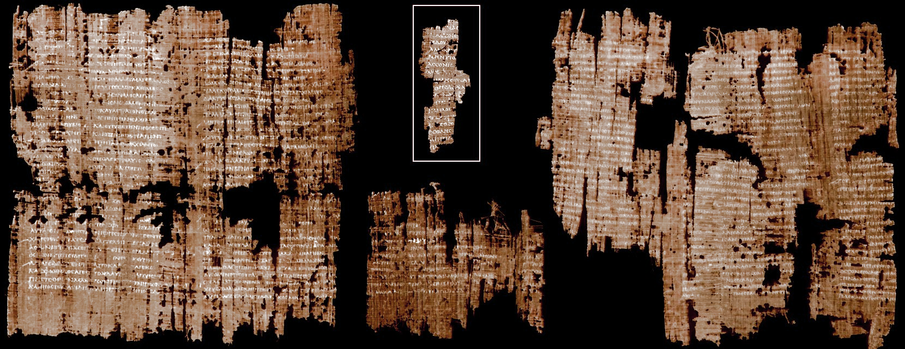

<div style="border-bottom:none;">
  <div align="center"> 
    
    <h1>Jigsaw Puzzling of Historical Fragments </h1>
    <h2>Within this research project, I focus on the analysis of historic fragments. </h2>
  </div>
</div>

 


## STRUCTURE

```

+-- Code
|   +-- Notebooks                        
|   |    +-- Jigsaw-Puzzling-Data-Analysis.ipynb
|   +-- Source                      
|   |    +-- __init__.py
|   |    +-- main.py
|   +-- Tests             
|        +-- test_main.py    
+-- Paper
+-- Presentation            
+-- requirements.txt                    
+-- README.md
+-- .gitignore              

```

## Links to Ressources

- Approch to understand the Dataset as [iPython](https://github.com/bohniti/Jigsaw-Puzzling/blob/master/Code/Notebooks/Jigsaw-Puzzling-Data-Analysis.ipynb)

## RESEARCH QUESTIONS

1. Is it possible to find all fragments which belong to the same page with a specific fragment as an input within the HisFrag20 Dataset?
2. Is it possible to find all fragments which belong to the same writer with a specific fragment as an input within the HisFrag20 Dataset?

## EVALUATION

As suggested by the Steuert et al. the evaluation will be done using a leave-one-image-out cross-validation approach. This means that every image of the test set will be used as a query for which the other test images will have to be ranked. 

The questions of interest are evaluated with the mean average precision (mAP). The mAP is based on the following values:
1. On a writer-level, i.e. the goal is to find fragments of the same writer. 
2. On a page-level, i.e. finding fragments of the same page

The Authors of the data provided a [basline system](https://github.com/anguelos/wi19_evaluate/tree/master/srslbp) and a [program](https://github.com/anguelos/wi19_evaluat) to make the evaluation more easy.


## THE DATASET

### 
  <div align="center"> 
    
  </div>

The [HisFrag20 dataset](https://zenodo.org/record/3893807#.X05Y3y336CM) was compiled by aSteuert et al. and published for the ICFHR 2020 Competition on Image Retrieval for Historical Handwritten Fragments (HisFrag20) [1].

The dataset contains a training and a test set with the following image naming-convention: 

```ruby
WID_PID_FID.jpg 

where 
WID = writer id
PID = page id, 
FID = fragment id.

```

The **train set** contains arround **100,000 fragments** using the Historical-IR19 as base dataset, they should all contain some text even some fragments are quite small. The **test set** contains about **20,000** new fragments

## Prerequisites

```
The dependencies to this project are stored in the file:
   - requirements.txt

I use python version 3.7.4
```

## Author

* **Timo Bohnstedt** - If you have questions you can contact me under [timo.bohnstedt@gmail.com](timo.bohnstedt@gmail.com)

## License

This project was done during my graduate studys in computer science at the University Erlangen-Nürnberg.


## SOURCE 

[1] M. Seuret, A. Nicolaou, D. Stutzmann, A. Maier , V. Christlein
“ICFHR 2020 Competition on Image Retrieval for Historical Handwritten Fragments”, International Conference on Frontiers of Handwriting Recognition, September, 2020